# MeowCare

A RAG-powered cat care knowledge assistant with cited answers.

**Live demo:** [meowcare-one.vercel.app](https://meowcare-one.vercel.app)

## About

MeowCare helps cat owners ask natural-language questions about cat health,
nutrition, daily care, and behavior. Instead of returning a generic chatbot
answer, it retrieves relevant passages from a curated cat care knowledge base,
uses Claude to synthesize a response, and shows source citations that users can
open and verify.

The project exists because pet care information is often fragmented across
forums, search results, blog posts, and social media. That creates a real
problem for owners who need a quick, grounded answer but do not know which
sources to trust. MeowCare is designed to make the first step clearer: summarize
the most relevant knowledge, preserve source attribution, and avoid pretending
to answer when the knowledge base does not contain enough information.

The primary audience is cat owners, especially first-time owners, adopters, and
people dealing with a new care routine or behavior question.

## Features

- Natural-language chat over a curated cat care knowledge base
- RAG pipeline: embedding generation, pgvector retrieval, and Claude answer
  synthesis
- Inline `[N]` source citations with clickable external links
- Cited-only source display: sources are shown only when the answer actually
  references them
- Clerk authentication with persistent per-user conversation history
- Sidebar conversation management with one-click deletion
- Admin panel at `/admin` for uploading, listing, and deleting Markdown
  knowledge base articles
- Analytics dashboard at `/admin/analytics` with total queries, today's
  queries, a 7-day trend, top retrieved articles, and recent queries
- Knowledge base of 20+ articles across health, nutrition, care, and behavior
- Toast notifications for transient API and network errors
- Security hardening: Supabase RLS + FORCE on all tables, server-side
  service-role database access, rate limiting, and input length caps

## Tech Stack

| Area | Technology |
| --- | --- |
| Frontend | Next.js 15.5.18 App Router, React, TypeScript, Tailwind CSS |
| Authentication | Clerk |
| Database | Supabase PostgreSQL with pgvector |
| AI | Anthropic Claude `claude-haiku-4-5-20251001`, OpenAI `text-embedding-3-small` |
| Retrieval | 1536-dimensional embeddings, pgvector similarity search |
| Rate limiting | Upstash Redis sliding-window limiter, 10 requests/minute/user |
| Deployment | Vercel with automatic deploys from GitHub |
| Quality gates | GitHub Actions CI, Husky pre-commit hooks, ESLint, TypeScript, build, npm audit |

## Architecture

MeowCare uses retrieval-augmented generation. User questions are embedded with
OpenAI, matched against the Supabase `documents` table through pgvector, and
assembled into a source-numbered prompt for Claude. The frontend then displays
the answer and filters the returned source list so only sources cited inline as
`[1]`, `[2]`, etc. are shown.

```mermaid
flowchart LR
  User["User question"] --> Embed["OpenAI embedding"]
  Embed --> Search["Supabase pgvector top-k search"]
  Search --> Context["Prompt assembly with numbered sources"]
  Context --> Claude["Claude answer generation"]
  Claude --> Answer["Answer with inline [N] citations"]
  Answer --> Filter["Frontend filters cited sources only"]
  Filter --> UI["Chat UI displays answer and clickable sources"]
```



### Data Model

- `documents`: chunked knowledge base articles with titles, categories, tags,
  source URLs, source files, and pgvector embeddings
- `conversations`: per-user conversation records keyed by Clerk user IDs
- `messages`: user and assistant messages, including JSON source metadata
- `queries`: usage analytics for questions and retrieved sources

All tables have row-level security enabled with `FORCE ROW LEVEL SECURITY`.
Server routes use `SUPABASE_SERVICE_ROLE_KEY`; user authorization is enforced in
application code using Clerk user IDs.

## Getting Started

### Prerequisites

- Node.js 20+
- npm
- Supabase project with PostgreSQL and pgvector enabled
- Clerk application
- Anthropic API key
- OpenAI API key
- Upstash Redis database for production rate limiting

### Environment Variables

The application reads the following environment variables. Copy
`.env.local.example` to `.env.local` and fill in your own values:

| Variable | Required for | Notes |
| --- | --- | --- |
| `NEXT_PUBLIC_SUPABASE_URL` | App, API routes, ingestion scripts | Supabase project URL |
| `NEXT_PUBLIC_SUPABASE_ANON_KEY` | Client-side Supabase helper | Public anon key |
| `SUPABASE_SERVICE_ROLE_KEY` | Server-side API routes and scripts | Keep server-only |
| `NEXT_PUBLIC_CLERK_PUBLISHABLE_KEY` | Clerk frontend/auth middleware | Required by Clerk |
| `CLERK_SECRET_KEY` | Clerk server-side auth | Required by Clerk |
| `NEXT_PUBLIC_CLERK_SIGN_IN_URL` | Clerk auth routes | Path for sign-in page, e.g. `/sign-in` |
| `NEXT_PUBLIC_CLERK_SIGN_UP_URL` | Clerk auth routes | Path for sign-up page, e.g. `/sign-up` |
| `ANTHROPIC_API_KEY` | `/api/chat` answer generation | Claude API key |
| `OPENAI_API_KEY` | Embeddings and ingestion | OpenAI API key |
| `UPSTASH_REDIS_REST_URL` | Rate limiting | Optional for local dev; enables Redis limiter |
| `UPSTASH_REDIS_REST_TOKEN` | Rate limiting | Optional for local dev; enables Redis limiter |
| `ADMIN_USER_IDS` | Admin access | Comma-separated Clerk user IDs |

### Setup

1. Clone the repository.

```bash
git clone https://github.com/peiweiwww/meowcare.git
cd meowcare
```

2. Install dependencies.

```bash
npm install
```

3. Create a local environment file and fill in the required keys.

```bash
cp .env.local.example .env.local
```

4. Apply the Supabase migrations in `supabase/migrations` to create the
   documents, conversations, messages, and analytics tables, the vector search
   function, and the RLS configuration. You can apply them through the Supabase
   SQL Editor, or with the Supabase CLI via `supabase db push`.

5. Ingest the Markdown knowledge base articles from `scripts/data`.

```bash
npm run ingest
```

6. Start the development server.

```bash
npm run dev
```

7. Open [http://localhost:3000](http://localhost:3000).

## Scripts

| Script | Command | Description |
| --- | --- | --- |
| `npm run dev` | `next dev` | Start the local Next.js development server |
| `npm run build` | `next build` | Create a production build |
| `npm run start` | `next start` | Run the production build locally |
| `npm run lint` | `next lint` | Run Next.js ESLint checks |
| `npm run ingest` | `npx ts-node --project tsconfig.json scripts/ingest.ts` | Embed and load Markdown articles from `scripts/data` into Supabase |
| `npm run test-search` | `npx ts-node --project tsconfig.json scripts/test-search.ts` | Run a sample vector search against the knowledge base |
| `npm run prepare` | `husky` | Install Husky Git hooks |

## Project Context

MeowCare was built for **MPCS 51238 Design, Build, Ship (Spring 2026)** at the
University of Chicago. The project was developed over four weekly iterations:

- **v1: Scaffolding and RAG backend** — initialized the Next.js app, configured
  Supabase with pgvector, built the ingestion pipeline, and verified vector
  search.
- **v2: Chat, auth, and history** — implemented the `/api/chat` RAG flow,
  Clerk authentication, and persistent per-user conversation history.
- **v3: Knowledge base, admin, and security** — expanded the knowledge base to
  20+ articles, added admin upload/delete flows, added analytics, enabled RLS,
  added rate limiting, and set up CI plus pre-commit gates.
- **v4: Product polish** — added source citation display, conversation
  deletion, cited-only source filtering, toast error handling, varied suggested
  questions, and this README.

## Screenshots

<!-- TODO: Add screenshots for the homepage, chat with sources, admin panel, and analytics dashboard -->
